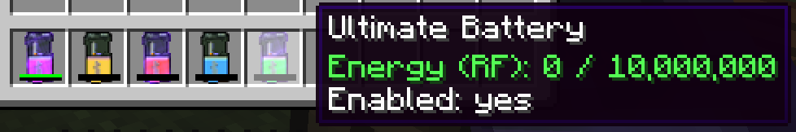

The Batteries Mod adds a few tiers of Battery items that the player can charge using Forge Energy (FE) that, when enabled and in the player's inventory, will provide power to other FE-based items automatically.

Shift+Right-Click with a Battery in-hand to enable/disable. An enabled battery will have a glowing Enchantment effect to indicate it is ready to charge other items.
A Creative Battery is also available.

Right-Click in the world with a battery in-hand to access its GUI (pictured above). Here, you can do the following:
  - Insert up to 9 references to items that you want to charge (or not) with this battery.
  - Toggle various charging behaviors. In order:
    - Whitelist/blacklist: Whitelist will only charge items that are referenced in the battery's inventory, while blacklist will charge everything except those item references
    - Charge Hotbar: Enable/disable charging of items in the hotbar
    - Charge Inventory: Enable/disable charging of items in the rest of the default inventory
    - Charge Armor: Enable/disable charging of worn armor
    - Charge Fairly: Enable/disable fair charging. When disabled, the battery will be drained without restriction to charge items in your inventory. When enabled, the battery will not charge an item that has more energy stored than it currently does. For example, a battery with 100,000 FE remaining will not charge an item that has 150,000 FE in it -- the intention is to prevent large-capacity and/or fast-draining items from sucking up all the battery power.
  
Currently, the mod assumes that you have another method to charge batteries (probably the same method you used to charge whatever item it is that this battery will charge!). In the future, a standalone Charging machine will be implemented.

Batteries will charge any item that accepts Forge Energy.
